#  第二章 Perceptron

**C2-1** 构建一个二分类问题：逻辑与(AND)的一般问题。

- 生成数据：正样本样本服从高斯分布，均值为$[1,1]$，协方差矩阵为单位矩阵；负样本服从三个高斯分布的混合高斯分布，这三个高斯分布的均值分别为$[0,0]$, $[0,1]$, $[1,0]$，每个高斯分布的协方差矩阵均为($\sigma$*单位矩阵)。

- 学习：设$$\sigma=0.01$$，请依上面的分布生成正负样本各$300$个，运用perceptron learning algorithm从数据中学习出一个perceptron，实现对正负样本的二分类。

- 实验与讨论：请通过编程实验，讨论如下问题：a. 学习算法的收敛性与哪些因素存在怎样的关系？b. 讨论当$\sigma$取值不断变大（如取值从$0.01$-$1$）情况下，学习算法的收敛性问题，由此可以得出怎样的结论？

### 实验结果及分析

为得到更好的可视化效果，生成数据的参数进行了适当的放大操作。

**实验设置**

- 分别选取不同的$$\sigma$$值进行实验 ，取值包括0.01，1，2，3，4，5，6，10，100，1000；
- 将正样本标记为1，降负样本标记为0
- 学习模型为单个神经元
- 激活函数使用sigmoid函数
- 损失函数使用均方差误差
- 优化方法使用批量梯度下降
- 学习率设为0.01
- batchsize设为16

针对不同的$$\sigma$$值得到的分类结下图所示，可以发现，当$$\sigma$$较小时，问题仍为线性可分，随着$$\sigma$$不断增大，线性分类模型的效果逐渐变差。

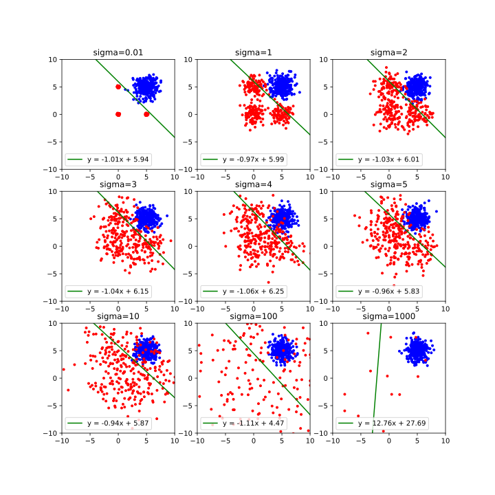

针对不同的$$\sigma$$值，学习过程中损失函数的变化如下图所示，可以发现，当$$\sigma$$较小时，具有很好的收敛性，随着$$\sigma$$不断增大，收敛结果逐渐变差，当$$\sigma$$非常大时，会出现不收敛的情况，甚至有损失值上升的情况。

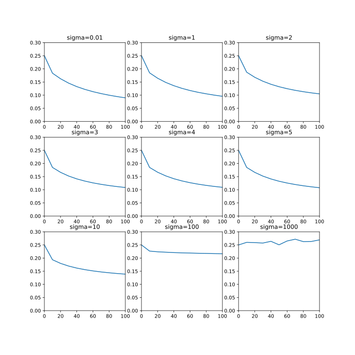

# 第三章 Regression with multiple variables 

**C3-1** 

- Generate $500$ data $(x,y)$, where $y=x+n$, $n$  is Gaussian distributed with the mean of zero and standard deviation of delt. Please use linear regression learning algorithm for estimating  $y$  from input $x$; 

- Do the same for $x=y+n$ but still for estimating $y$ from input $x$;

- Make a comparison on the regression curves with $x$ as the input and $y$ as the output of the regressor obtained from (i) and (ii) respectively . 

### 实验结果及分析

**实验设置**

- 分别选取不同的$$\sigma$$值进行实验 ，取值包括1, 50, 100, 150, 200, 250；
- 学习模型为单个神经元
- 无激活函数
- 损失函数使用均方差误差
- 优化方法使用批量梯度下降
- 学习率设为0.01
- batchsize设为16

（1）使用$$y=x+n$$生成数据，回归结果如下

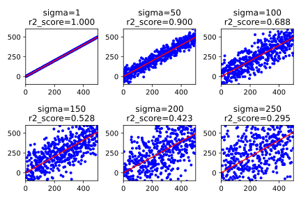

（2）使用$$x=y+n$$生成数据

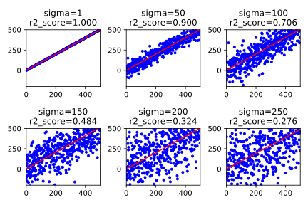

（3）使用$$y=-x+n$$生成数据

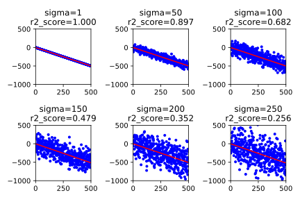

通过分析使用三组不同分布的数据进行回归得到的结果，随着噪声方差的增大，回归结果的$$R^2$$分数逐渐增大，但是最终得到的回归直线变化不大。


# 第四章 Multi-layer perceptron

**C4-1** (Duda’s book, p.396, 5.)Write a basic backpropagation program for a 3-3-1 network with bias to solve the three-bit parity problem, i.e., return a +1 if the number of input units is even, and -1 if odd. Show the input-to-hidden weights and analyze the function of each hidden unit. 

### 实验结果及分析

**实验设置**

- 学习模型为3-3-1结构的多层感知机

```
_________________________________________________________________
Layer (type)                 Output Shape              Param #   
=================================================================
dense_1 (Dense)             (None, 3)                 12        
_________________________________________________________________
dense_2 (Dense)             (None, 3)                 12        
_________________________________________________________________
dense_3 (Dense)             (None, 1)                 4         
=================================================================
Total params: 28
Trainable params: 28
Non-trainable params: 0
_________________________________________________________________
```

- 每个神经元的激活函数为$\text {tanh}$
- 损失函数使用均方差误差
- 优化方法使用批量梯度下降
- 学习率设为0.01
- batchsize设为8

训练数据为8种三位二进制数
$$
X=\left(\begin{array}{c}
0 \quad 0 \quad 0\\
0 \quad 0 \quad 1\\
0 \quad 1 \quad 0\\
0 \quad 1 \quad 1\\
1 \quad 0 \quad 0\\
1 \quad 0 \quad 1\\
1 \quad 1 \quad 0\\
1 \quad 1 \quad 1\\
\end{array}\right)
$$
标签为
$$
Y=\left(\begin{array}{c}
1 \\
-1 \\
-1 \\
1\\
-1\\
1\\
1\\
-1\\
\end{array}\right)
$$
训练结果为
$$
\hat Y=\left(\begin{array}{c}
0.97855276 \\
-0.9767887 \\
-0.9770291 \\
0.971154754\\
-0.9787459\\
0.98080057\\
0.980549\\
-0.9826546\\
\end{array}\right)
$$
经符号函数过滤后，得到
$$
\sigma(\hat Y) = \left(\begin{array}{c}
1 \\
-1 \\
-1 \\
1\\
-1\\
1\\
1\\
-1\\
\end{array}\right)
$$
该模型用于三位奇偶校验问题的准确率为$100\%$

分类超“平面”在空间中如下图所示

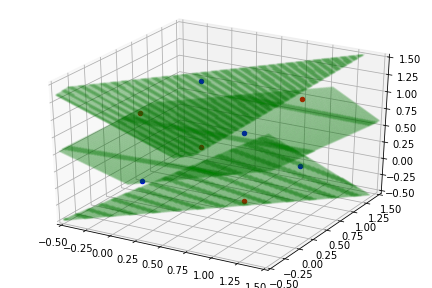


**C4-2** (regression problem) train a neural network, to predict the burned area of the forest, using the data from http://archive.ics.uci.edu/ml/datasets/Forest+Fires

**实验设置**

- 学习模型为256-256-128-1结构的多层感知机

```
_________________________________________________________________
Layer (type)                 Output Shape              Param #   
=================================================================
dense_1 (Dense)             (None, 256)               3072      
_________________________________________________________________
dense_2 (Dense)             (None, 256)               65792     
_________________________________________________________________
dense_3 (Dense)             (None, 128)               32896     
_________________________________________________________________
dense_4 (Dense)             (None, 1)                 129       
=================================================================
Total params: 101,889
Trainable params: 101,889
Non-trainable params: 0
_________________________________________________________________
```

- 每个神经元的激活函数为$\text {tanh}$
- 损失函数使用均方差误差
- 优化方法使用批量梯度下降
- 学习率设为0.001
- batchsize设为16
- 训练集和验证集的划分比为8：2

**实验步骤**

- **Step 1** 数据预处理

  1. 将 'jan', 'feb', 'mar', 'apr', 'may', 'jun', 'jul', 'aug', 'sep', 'oct', 'nov', 'dec' 转化为对应月份的数字
  2. 去除'day'（星期）列，以为星期与我们最后的目标无关
  3. 采用Z-score标准化

  $$
  z=\frac{x-\mu}{\sigma}
  $$

- **Step 2 ** 搭建并训练神经网络

搭建神经网络

```python
model = Sequential()

model.add(Dense(256, input_dim=x.shape[1], activation='tanh'))
model.add(Dense(256, activation='tanh'))
model.add(Dense(128, activation='tanh'))
model.add(Dense(1, activation='tanh'))
 
sgd = SGD(lr=0.001, decay=1e-6)
model.compile(loss='mse', optimizer=sgd)
```

训练神经网络

```python
history = model.fit(x, y, validation_split=0.8, epochs=100, batch_size=16)
```

- **Step 3 ** 展示训练结果

训练集和验证集的损失随epoch的变化如下图所示

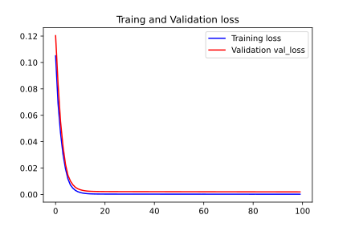

经100轮训练，训练集和验证集的loss值几乎降为0


**C4-3** (classification problem，MNIST) 训练一个分类器，实现对数字手写字符识别数据http://yann.lecun.com/exdb/mnist/的分类。

**实验设置**

- 学习模型为256-256-128-10结构的多层感知机

```
_________________________________________________________________
Layer (type)                 Output Shape              Param #   
=================================================================
dense_1 (Dense)             (None, 256)               200960    
_________________________________________________________________
dense_2 (Dense)             (None, 256)               65792     
_________________________________________________________________
dense_3 (Dense)             (None, 128)               32896     
_________________________________________________________________
dense_4 (Dense)             (None, 10)                1290      
=================================================================
Total params: 300,938
Trainable params: 300,938
Non-trainable params: 0
_________________________________________________________________
```

- 每个神经元的激活函数为$\text {relu}$
- 损失函数使用交叉熵损失
- 优化方法使用批量梯度下降
- 学习率设为0.001
- batchsize设为16
- 训练集和验证集的划分比为8：2

**实验步骤**

- **Step 1** 读取数据
  1. 读取到的数据的规模为`(60000, 28, 28)`
  2. 读取到的标签的规模为`(60000,)`

- **Step 2** 数据预处理
  1. 将单个数据展平，转化为`(60000, 784)`，并全部除以255（归一化）
  2. 将标签转化为one-hot编码

- **Step 3 ** 搭建并训练神经网络

搭建神经网络

```python
model = Sequential()

model.add(Dense(256, input_dim=x.shape[1], activation='relu'))
model.add(Dense(256, activation='relu'))
model.add(Dense(128, activation='relu'))
model.add(Dense(10, activation='softmax'))

sgd = SGD(lr=0.001, decay=1e-6)
model.compile(loss=categorical_crossentropy, optimizer=sgd, metrics=['accuracy'])
```

训练神经网络

```python
history = model.fit(x, y, validation_split=0.8, epochs=100, batch_size=16)
```

- **Step 4 ** 展示训练结果

训练集和验证集的损失随epoch的变化如下图所示

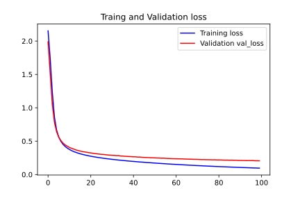

训练集和验证集的准确率随epoch的变化如下图所示

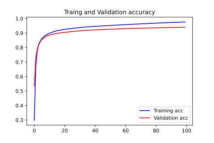

经过100轮的训练，训练集的准确率能够达到97%以上，验证集的准确率能够达到94%以上。


#  第五章 Performance evaluation

**C5-1** 构建一个类别不平衡的二分类问题。

（1）生成数据：正样本样本服从高斯分布，均值为[2,3]，协方差矩阵为单位矩阵；负样本服从高斯分布，均值为[5,6]，协方差矩阵为单位矩阵。

（2）学习：请依上面的分布生成正样本200个，负样本800个，将其划分为包含60%样本的训练集、20%样本的验证集和20%样本的测试集，通过分别构建两个不同的MLP模型实现对正负样本的二分类。其中第一个MLP模型含有一个隐层，第二个MLP模型含有两个隐层。

（3）实验与讨论：请通过编程实验，讨论如下问题：a. 若要求MLP模型对于正例样本的预测有更高的查准率和查全率，请考虑在模型选择中采用哪种性能衡量指标；b.通过绘制学习曲线，分析模型的偏差与方差；c.通过绘制ROC曲线，比较两个MLP模型。

### 实验结果及分析

**实验设置**

- 学习模型1为10-2结构的多层感知机

```
_________________________________________________________________
Layer (type)                 Output Shape              Param #   
=================================================================
dense_1 (Dense)             (None, 10)                30        
_________________________________________________________________
dense_2 (Dense)             (None, 2)                 22        
=================================================================
Total params: 52
Trainable params: 52
Non-trainable params: 0
_________________________________________________________________
```

- 学习模型2为10-2结构的多层感知机

  ```
  _________________________________________________________________
  Layer (type)                 Output Shape              Param #   
  =================================================================
  dense_1 (Dense)             (None, 10)                30        
  _________________________________________________________________
  dense_2 (Dense)             (None, 10)                110       
  _________________________________________________________________
  dense_3 (Dense)             (None, 2)                 22        
  =================================================================
  Total params: 162
  Trainable params: 162
  Non-trainable params: 0
  _________________________________________________________________
  ```

- 每个神经元的激活函数为$\text {sigmoid}$

- 损失函数使用MSE损失

- 优化方法使用批量梯度下降

- 学习率设为0.001

- batchsize设为64

- 训练集、验证集和测试集的划分比为6：2：2

**实验步骤**

- **Step 1** 生成数据，共200个正样本（蓝色），800个负样本（红色）

  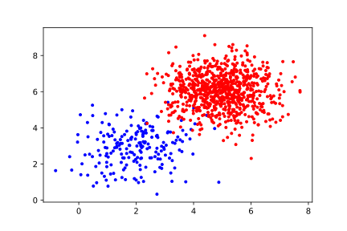

- **Step 2 ** 搭建并训练神经网络（以模型1为例）

搭建神经网络

```python
model1 = Sequential()

model1.add(Dense(10, input_shape=((2,)), activation='sigmoid'))
model1.add(Dense(1, activation='sigmoid'))

sgd = SGD(lr=0.001, decay=1e-6)
model1.compile(loss='mse', optimizer=sgd, metrics=['accuracy', recall, precision, f1])
```

训练神经网络

```python
history = model1.fit(x, y, validation_data=(val_x, val_y), epochs=200, batch_size=64)
```

- **Step 3 ** 展示训练结果

模型1训练集和验证集的损失随epoch的变化如下图所示

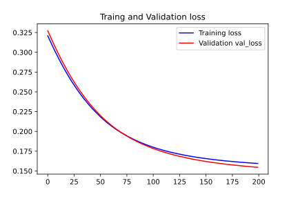

模型1训练集和验证集的准确率、召回率、精确率和F1分数随epoch的变化如下图所示

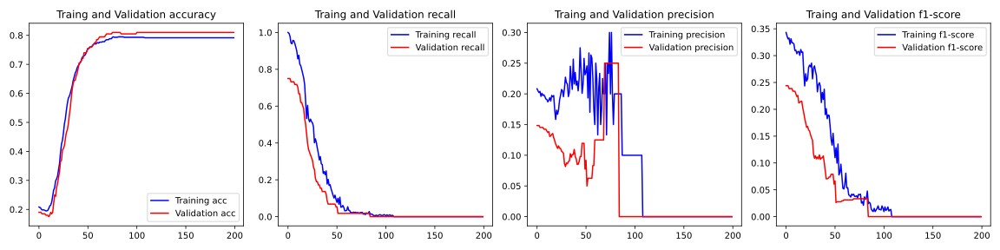

模型1训练集、验证集和测试集的分类结果如下图所示

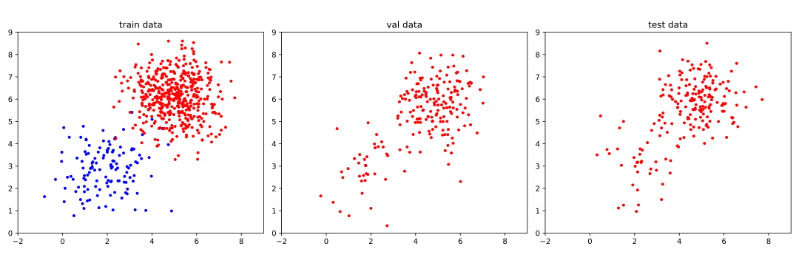

模型1训练集、验证集和测试集的ROC曲线如下图所示

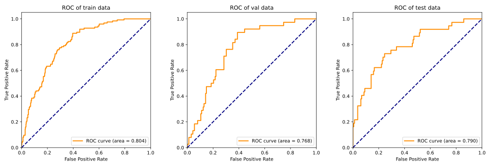

模型2训练集和验证集的损失随epoch的变化如下图所示

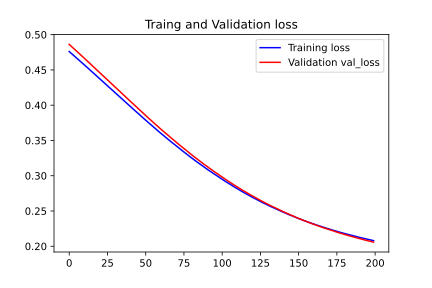

模型2训练集和验证集的准确率、召回率、精确率和F1分数随epoch的变化如下图所示

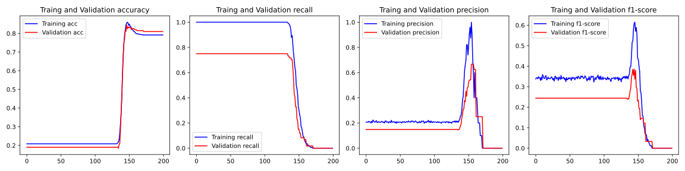

模型2训练集、验证集和测试集的分类结果如下图所示


模型2训练集、验证集和测试集的ROC曲线如下图所示

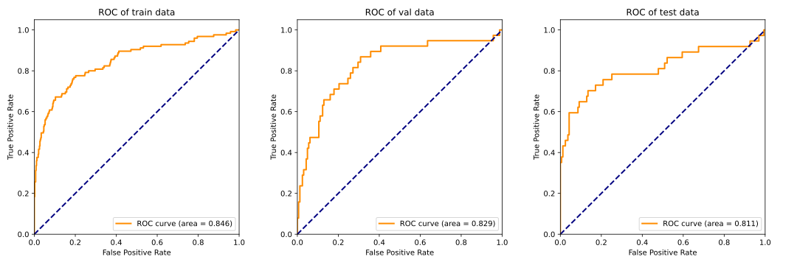


可以发现，针对此问题，模型1和模型2在训练集上都能够得到较好的结果，但是在验证集和测试集上表现很差，正样本很容易被判断为负样本，导致召回率和精确率很低。但是从ROC曲线的表现上来看，模型2比模型1稍微好一些，但也没有明显的优化，说明了对于MLP来说，解决这种样本不均衡的问题仍然具有一定的局限性，对于模型的评估应更注重召回率或精确率这两个指标，或者F1分数，而不是关注准确率或loss值。


# 第六章SVM

**C6-1** Fisheriris data can be read by the following matlab command:

​	‘load fisheriris’.

Its meaning can be found from the internet.

(a) Use one-against-all strategy to decompose the 4-ary classification problem into binary classification problems. Use SVM to solve each binary classification problems and combine all the binary classifiers to solve the problem.

(b) Use KNN to solve the fisheriris data classification problem. 

(c) Use MLP to solve each binary classification problems and combine all the binary classifiers to solve the problem.

​	Compare the generalization performance and the storage required for the classifiers obtained in (a), (b) and (c). 

### 实验结果及分析

**(a) SVM**

**实验设置**

- 不使用核方法

- 训练集和测试集的划分比为7：3

**实验结果**

```
class 0 against rest: The accuracy0 is 1.0
class 1 against rest: The accuracy1 is 0.9111111111111111
class 2 against rest: The accuracy2 is 0.9555555555555556
```

**(b) KNN**

**实验设置**

- 默认使用欧式距离

- 训练集和测试集的划分比为7：3

**实验结果**

```
y_predict =  [0 0 2 1 1 0 1 1 1 2 0 1 0 2 1 1 0 0 2 0 2 1 0 1 0 2 1 0 2 1 1 1 2 0 1 0 0
 1 1 0 0 0 2 0 1]
y_test =  [0 0 2 1 1 0 1 1 2 2 0 1 0 2 1 1 0 0 2 0 2 1 0 1 0 2 1 0 1 1 1 1 2 0 1 0 0
 1 1 0 0 0 2 0 1]
The accuracy is: 0.9555555555555556
```

**实验设置**

- 学习模型2为10-2结构的多层感知机（与上一题目相同）

  ```
  _________________________________________________________________
  Layer (type)                 Output Shape              Param #   
  =================================================================
  dense_1 (Dense)             (None, 10)                30        
  _________________________________________________________________
  dense_2 (Dense)             (None, 10)                110       
  _________________________________________________________________
  dense_3 (Dense)             (None, 2)                 22        
  =================================================================
  Total params: 162
  Trainable params: 162
  Non-trainable params: 0
  _________________________________________________________________
  ```

- 每个神经元的激活函数为$\text {sigmoid}$

- 损失函数使用MSE损失

- 优化方法使用批量梯度下降

- 学习率设为0.01

- batchsize设为8

- 训练集和验证集（测试集）的划分比为7：3

**实验结果**

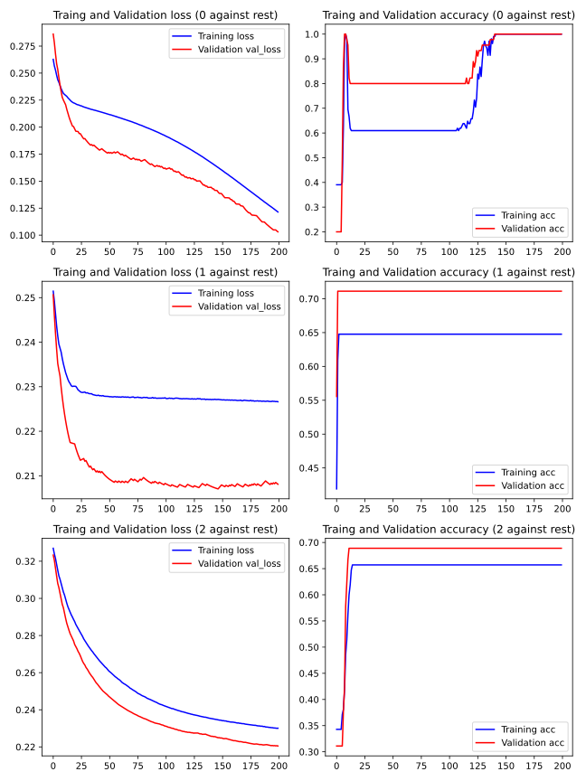

**总结**

本题是一个多分类问题，且训练样本较少，使用SVM和KNN方法效果很好，而使用MLP有两个缺点：

- 训练样本较少，随机划分训练集和测试集可能导致有样本不均衡，MLP效果就会变差，训练曲线呈现病态
- MLP需要人为设定一些参数，比如训练轮数、学习率等，不如SVM和KNN使用方便

SVM的优势在于在少量样本的情况下可以得到很好的结果，KNN在本题的优势在于直接解决多分类问题（当然，MLP也可设计为解决多分类问题的结构，然而仍会面临上述两个问题）。


**C6-2** (选) 在西瓜数据集3.0$\alpha$上分别用线性核和高斯核训练SVM，并比较其支持向量的差别。

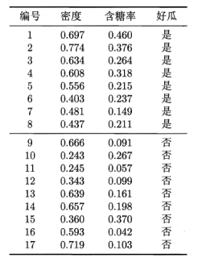

实验设置同 **C6-1** SVM 部分（核函数不同）

**实验结果**

- 使用线性核准确率为0.5294117647058824

- 使用高斯核准确率为0.9411764705882353

下图展示了使用线性核和使用高斯核的预测结果，其中绿色圆圈圈起来的点是预测正确的样本

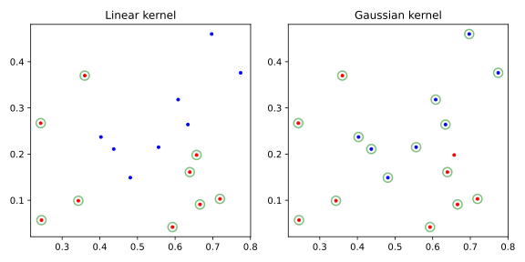

使用高斯核的SVM的支持向量比使用线性核的SVM的支持向量数量要多，且在分布上也较复杂。


# 第七章 K-means

**C7-1** 试编程实现K-means算法，设置三组不同的k值、三组不同的初始中心点，在西瓜数据集4.0上进行实验比较，并讨论什么样的初始中心有利于取得好结果。

### 实验结果及分析

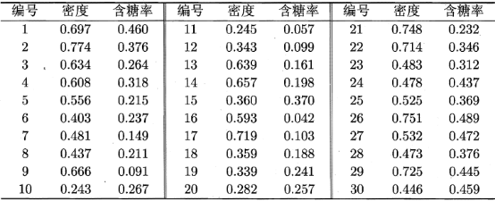

对于k分别取2，3，4，得到的聚类结果如下

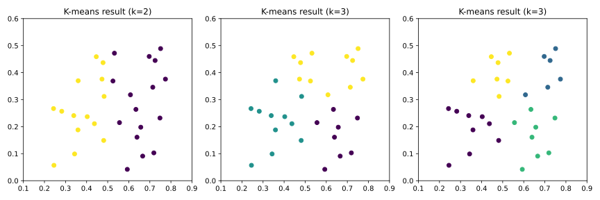

对于选取不同的初始中心位置，得到的聚类结果如下（三角形为初始中心位置）

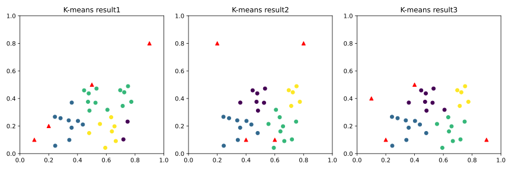

可以发现不同的初始中心位置，可能会影响到最终的收敛结果，如图1；而有时不会对结果产生影响，如图2、3.一般来说，将初始中心位置选在尽可能靠近更多数据点的位置，有利于收敛到较好的结果。


# 第八章 Dimension reduction

### 实验结果及分析

**C8-1** 请通过对Iris data的可视化，比较PCA、LDA和ICA的可视化效果。

分别使用PCA、LDA和ICA对Iris数据集进行降维后得到的结果如下图

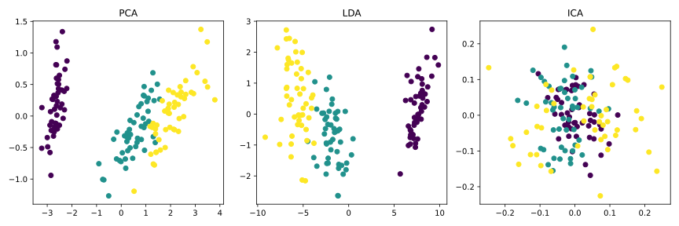

根据可视化结果可以看出由PCA和LDA得到的降维结果一定程度上反映了样本特征和类别的关系，而由ICA得到的降维结果没有反映出样本特征和类别的关系。
